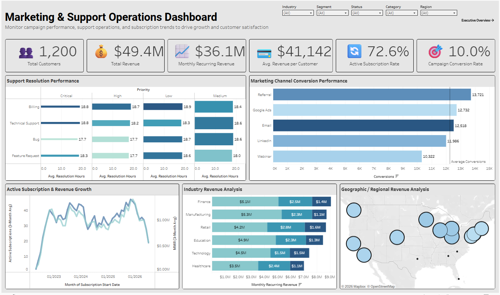

# Enterprise SaaS Revenue & Customer Analytics Suite

## Project Overview
Interactive Tableau dashboard suite analyzing SaaS revenue performance, customer behavior, and key business KPIs. This project focuses on identifying revenue growth trends, customer performance patterns, and executive-level insights through interactive data visualization and business intelligence reporting.

## Tools Used
- Tableau
- SQL
- Excel

## Key Insights
- Identified high-performing customer segments
- Analyzed recurring revenue and growth trends
- Evaluated customer retention and engagement metrics
- Tracked KPI performance across business categories
- Highlighted revenue drivers and business opportunities

## Dashboard Features
- Interactive dashboard filters
- Executive KPI scorecards
- Revenue trend analysis
- Customer segmentation visuals
- Performance monitoring dashboards
- Business intelligence reporting views

## Dashboard Preview

## Live Dashboard
[View on Tableau Public][(https://public.tableau.com/app/profile/jeremy.dade/viz/EnterpriseSaaSRevenueCustomerAnalyticsSuite/ExecutiveSaaSOverview)]
